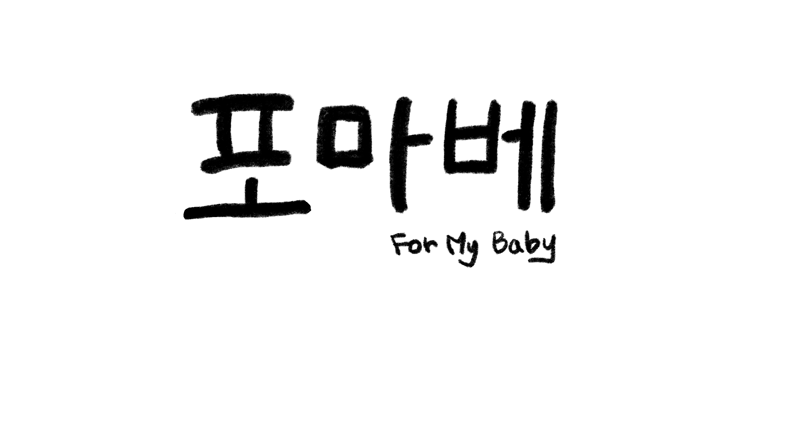
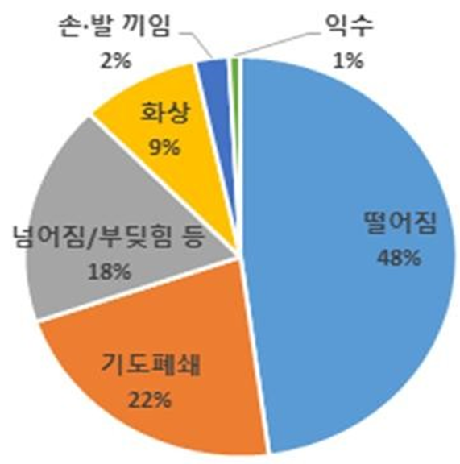
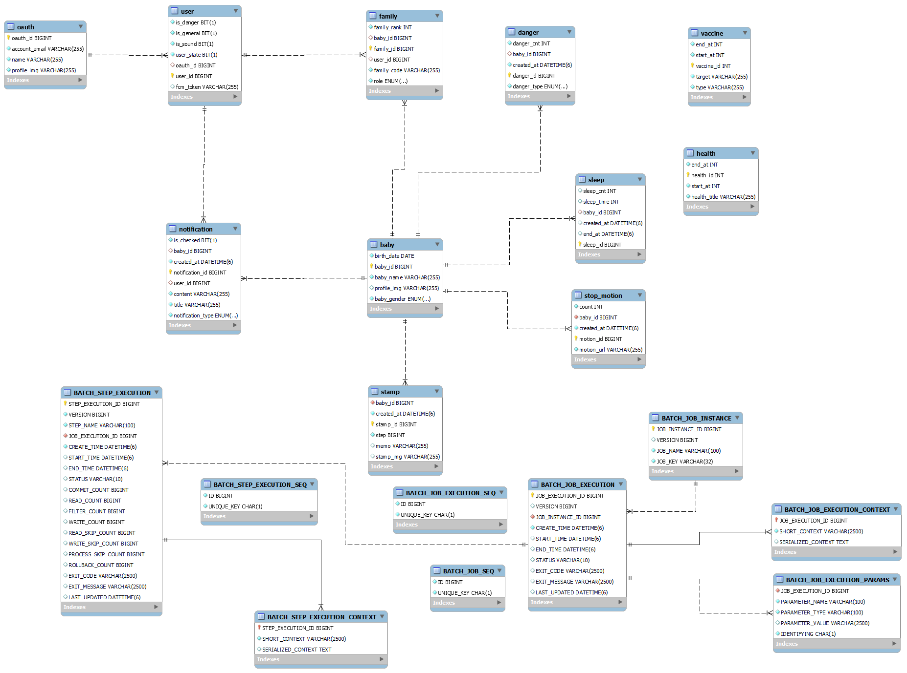
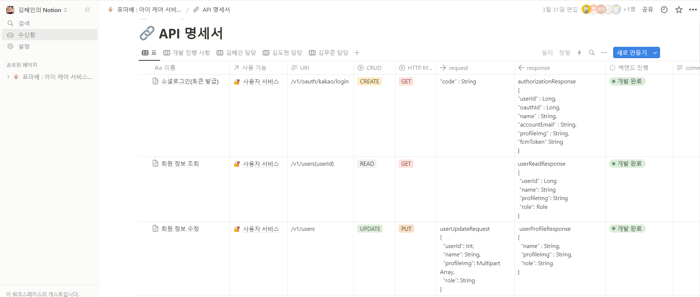
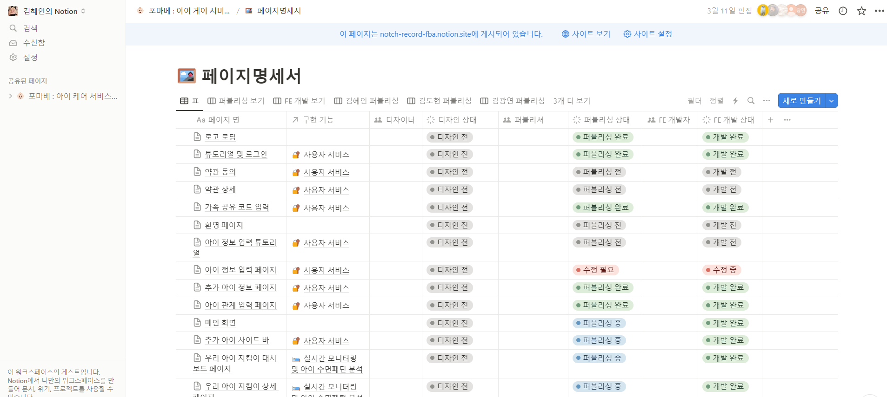
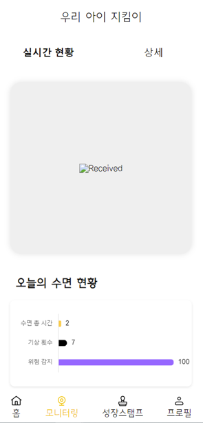
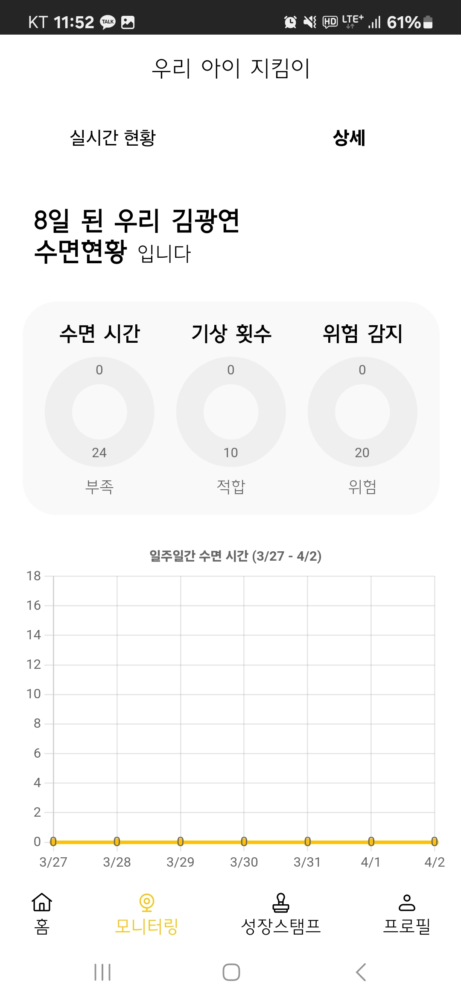
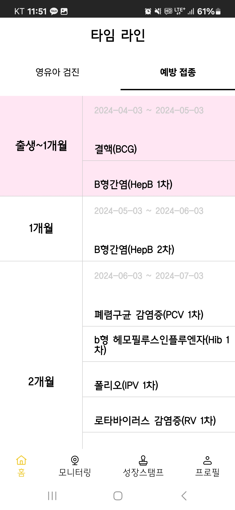
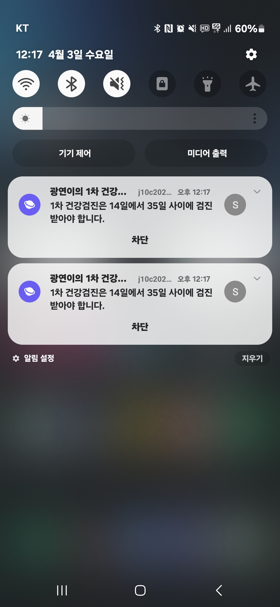

# README

## FOR MY BABY

[부모가 한숨 돌릴 수 있는 아이 지킴이]

## 프로젝트 개요
### 프로젝트 기획의도

###### 출처: 소방청

- 영유아 사고의 약 31%는 생활안전사고이다.
    - 이 중 92%가 가정에서 일어난다.
- 영유아는 하루의 대부분을 잠으로 보낸다.
    - 영유아는 수면의 질과 패턴이 매우 중요하다

***침대에서 아이의 수면과 행동을 분석하자 !!***

### 기능

1. 보호자가 자리를 떠나도 아이의 수면과 위험행동을 감지
2. 실시간으로 아기 방의 환경 모니터링 및 수면패턴 분석과 알림
3. 건강 검진 및 접종 일정 타임라인과 알림
4. 부모가 못본 아이의 귀여운 행동을 자동으로 캡쳐, 스톱모션 영상 제작
5. 가족 공유 코드로 계정을 연결하여 아이를 다 함께 관리

### 기간
2024-02-19 ~ 2024-04~04 (6주)

### 팀원
|김광연|김준형|임채진|김무준|김도현|김혜인
|:---:|:---:|:---:|:---:|:---:|:---:|
| FE / AI | FE | AI | BE | BE / INFRA | INFRA |

## ⚙ 개발 환경
**FE**

**BE**

**AI**

**DevOps**

 

**협업**

 
                                                                             

## ER 다이어그램

## API 명세서

https://www.notion.so/1227ef1f15f54148a51f36aefc0e3289?v=3cef4b8b00654b2cbe4db7d83294cd7f

  
  
    

## 화면 정의서

https://www.notion.so/a8139528b99c4278961ed2ca37cfcbf0?v=be78df78104647a09bf164efca0c9e8b

  

## 주요 기능 및 화면

### 아이 지킴이

  

### 수면 패턴 분석

### 검진/접종 타임라인

### 푸시알림

## :family:  팀원소개

**Front End** 
김광연 김준형 임채진

**Back End**
김무준 김도현 김혜인

